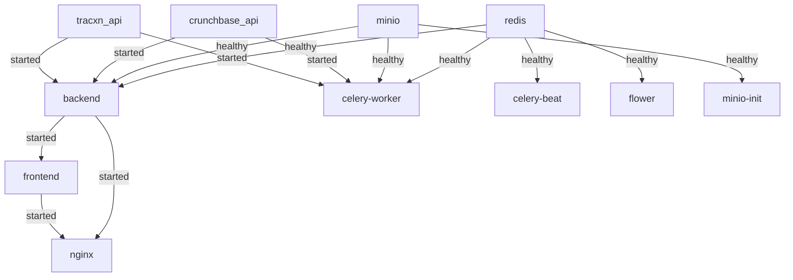

## Purpose
Complete map of all running services, ports, volumes, dependencies, and communication paths for MarketNavigator v2. Use this document to understand the system architecture and troubleshoot connectivity issues.

---

## Service Overview

MarketNavigator v2 runs **10 services** in Docker containers:

| Service | Container Name | Purpose | Ports (Host:Container) |
|---------|---------------|---------|------------------------|
| **redis** | mn2-redis | Cache, message broker, Celery backend | 6379:6379 |
| **minio** | mn2-minio | S3-compatible object storage for files | 9000:9000, 9001:9001 |
| **minio-init** | mn2-minio-init | One-time MinIO bucket initialization | N/A (exits after setup) |
| **crunchbase_api** | mn2-crunchbase-api | Crunchbase data scraper service | 8003:8003 |
| **tracxn_api** | mn2-tracxn-api | Tracxn data scraper service | 8008:8008 |
| **backend** | mn2-backend | Django REST Framework API (Daphne ASGI) | 8000:8000 |
| **celery-worker** | mn2-celery-worker | Background task processor | N/A (internal only) |
| **celery-beat** | mn2-celery-beat | Scheduled task scheduler | N/A (internal only) |
| **flower** | mn2-flower | Celery monitoring dashboard | 5555:5555 |
| **frontend** | mn2-frontend | Next.js 14 web application | 3000:3000 |
| **nginx** | mn2-nginx | Reverse proxy with SSL (prod only) | 80:80, 443:443 |

---

## Port Mapping

### Development Ports (docker-compose.yml)
```
3000  → Next.js frontend (direct access)
5555  → Flower dashboard (Celery monitoring)
6379  → Redis (direct access for debugging)
8000  → Django backend (direct access)
8003  → Crunchbase API (scraper)
8008  → Tracxn API (scraper)
9000  → MinIO API (S3-compatible storage)
9001  → MinIO Console (web UI)
```

### Production Ports (docker-compose.prod.yml)
```
80    → Nginx (HTTP, redirects to HTTPS)
443   → Nginx (HTTPS, SSL termination)
      Internal services not exposed directly
```

---

## Service Dependencies

### Startup Order & Health Checks



### Service Dependencies Table

| Service | Depends On | Condition | Reason |
|---------|-----------|-----------|---------|
| **backend** | redis | healthy | Needs cache & Celery broker |
| | minio | healthy | Needs file storage |
| | crunchbase_api | started | Needs scraper integration |
| | tracxn_api | started | Needs scraper integration |
| **celery-worker** | redis | healthy | Needs message broker |
| | minio | healthy | Needs file storage for tasks |
| | crunchbase_api | started | Tasks call scraper APIs |
| | tracxn_api | started | Tasks call scraper APIs |
| **celery-beat** | redis | healthy | Needs broker for scheduled tasks |
| **flower** | redis | healthy | Monitors Celery via Redis |
| **minio-init** | minio | healthy | Must wait for MinIO startup |
| **frontend** | backend | started | Needs API endpoints |
| **nginx** (prod) | frontend, backend | started | Proxies both services |

---

## Communication Paths

### Internal Docker Network Communication

All services communicate via Docker's default bridge network using **container names as hostnames**.

#### Backend → Redis
```
URL: redis://redis:6379/0
Purpose: Cache, Celery broker, WebSocket channel layer
Protocol: Redis Wire Protocol (TCP)
```

#### Backend → MinIO
```
URL: http://minio:9000
Purpose: File upload/download (S3 API)
Protocol: HTTP (S3-compatible REST API)
Credentials: minioadmin / minioadmin123
```

#### Backend → Crunchbase API
```
URL: http://crunchbase_api:8003
Endpoints:
  - POST /search - Company search
  - GET /company/{uuid} - Company details
Protocol: HTTP REST API
```

#### Backend → Tracxn API
```
URL: http://tracxn_api:8008
Endpoints:
  - POST /search - Company search
  - GET /company/{id} - Company details
Protocol: HTTP REST API
```

#### Celery Worker → Redis
```
URL: redis://redis:6379/0
Purpose: Task queue (broker) & result backend
Protocol: Redis Wire Protocol
```

#### Frontend → Backend (Development)
```
URL: http://localhost:8000
Purpose: REST API calls, WebSocket connections
Protocol: HTTP/1.1, WebSocket (ws://)
CORS: Enabled for localhost:3000
```

#### Frontend → Backend (Production)
```
URL: https://market.kareonecompany.com
Purpose: REST API calls, WebSocket connections
Protocol: HTTPS, WSS (secure WebSocket)
Proxy: Nginx handles SSL termination
```

---

## Data Persistence (Volumes)

### Named Docker Volumes

| Volume Name | Service | Mount Point | Purpose | Backup Priority |
|------------|---------|-------------|---------|-----------------|
| **redis_data** | redis | /data | Redis persistence (AOF enabled) | HIGH |
| **minio_data** | minio | /data | All uploaded files (reports, documents) | CRITICAL |
| **backend_media** | backend, celery-worker | /app/media | Generated reports, temp files | MEDIUM |
| **backend_static** | backend | /app/static | Static assets (collectstatic) | LOW |

### Production Volume (docker-compose.prod.yml)
| Volume Name | Service | Mount Point | Purpose |
|------------|---------|-------------|---------|
| **letsencrypt_data** | nginx | /etc/letsencrypt | SSL certificates (Let's Encrypt) |

### Host Bind Mounts (Development Only)

| Local Path | Container Path | Service | Purpose |
|-----------|---------------|---------|---------|
| `./backend` | `/app` | backend, celery-worker, celery-beat | Live code reload |
| `./frontend/src` | `/app/src` | frontend | Live code reload |
| `./scrapers/Crunchbase_API` | `/app` | crunchbase_api | Live code reload |
| `./scrapers/Tracxn_API` | `/app` | tracxn_api | Live code reload |
| `./nginx/nginx.conf` | `/etc/nginx/nginx.conf` | nginx | Proxy configuration |
| `./nginx/ssl` | `/etc/nginx/ssl` | nginx | SSL certificates |

---

## External Database Connection

### PostgreSQL (Remote Liara Cloud)

**Development:**
```
Host: table-mountain.liara.cloud
Port: 32965
Database: postgres
User: root
Password: AZ6t2MguosDdJ8oCval6B7bU
```

**Production:**
```
Host: marketnavigator-v2 (private network DNS)
Port: 5432
Database: postgres
User: root
Password: AZ6t2MguosDdJ8oCval6B7bU
```

**Connection from:**
- backend
- celery-worker
- celery-beat

**Note:** PostgreSQL is NOT containerized. It runs as a managed database on Liara Cloud infrastructure.

---

## Scraper Database Connections

### Crunchbase API
- **Database:** Remote MySQL on Liara
- **Configuration:** Loaded from `scrapers/Crunchbase_API/.env`
- **Note:** Uses separate database for scraped Crunchbase data

### Tracxn API
- **Database:** Remote MySQL on Liara
- **Configuration:** Defined in `scrapers/Tracxn_API/config.py`
- **Note:** Uses separate database for scraped Tracxn data

---

## Health Check Endpoints

### Service Health Monitoring

| Service | Health Check | Interval | Timeout | Retries |
|---------|-------------|----------|---------|---------|
| **redis** | `redis-cli ping` | 5s | 5s | 5 |
| **minio** | `curl http://localhost:9000/minio/health/live` | 30s | 20s | 3 |
| **backend** | `curl http://localhost:8000/api/health/` | 30s | 10s | 3 |

### Manual Health Checks

```bash
# Check Redis
docker exec mn2-redis redis-cli ping
# Expected: PONG

# Check MinIO
curl http://localhost:9000/minio/health/live
# Expected: 200 OK

# Check Django backend
curl http://localhost:8000/api/health/
# Expected: {"status": "healthy"}

# Check Celery workers
docker exec mn2-celery-worker celery -A config inspect active
# Expected: List of active tasks

# Check frontend
curl http://localhost:3000
# Expected: HTML response
```

---

## Service Restart Policies

All services use `restart: unless-stopped` except `minio-init` (exits after completion).

**Behavior:**
- Containers restart automatically on failure
- Do NOT restart if manually stopped with `docker stop`
- Restart on server reboot (via systemd Docker service)

**Change restart policy:**
```bash
# Production: Always restart
docker update --restart=always mn2-backend

# Development: No restart
docker update --restart=no mn2-backend
```

---

## Common Troubleshooting Scenarios

### Backend can't connect to Redis
**Symptom:** Connection refused on redis:6379  
**Solution:**
```bash
# Check Redis health
docker ps | grep redis
docker logs mn2-redis --tail 50

# Verify network connectivity
docker exec mn2-backend ping redis
```

### Backend can't connect to MinIO
**Symptom:** S3 upload fails, connection refused  
**Solution:**
```bash
# Check MinIO health
docker exec mn2-minio curl -f http://localhost:9000/minio/health/live

# Verify bucket exists
docker exec mn2-minio-init mc ls myminio/
```

### Scraper APIs not responding
**Symptom:** 500 errors when generating reports  
**Solution:**
```bash
# Check scraper logs
docker logs mn2-crunchbase-api --tail 100
docker logs mn2-tracxn-api --tail 100

# Test scraper endpoints
curl http://localhost:8003/health || echo "Crunchbase down"
curl http://localhost:8008/health || echo "Tracxn down"
```

### Frontend can't reach backend
**Symptom:** API calls fail with CORS or network errors  
**Solution:**
```bash
# Check NEXT_PUBLIC_API_URL
docker exec mn2-frontend env | grep NEXT_PUBLIC_API_URL

# Verify backend is accessible
curl http://localhost:8000/api/health/
```

---

## Network Topology Diagram

```
┌─────────────────────────────────────────────────────────────┐
│                         Host Machine                         │
│  Ubuntu Server (Production) / Dev Machine (Local)           │
└─────────────────────────────────────────────────────────────┘
                              │
            ┌─────────────────┴─────────────────┐
            │    Docker Bridge Network (default) │
            └─────────────────┬─────────────────┘
                              │
    ┌─────────────────────────┼─────────────────────────┐
    │                         │                         │
┌───▼───┐              ┌──────▼──────┐          ┌──────▼──────┐
│ nginx │◄─────────────┤  frontend   │          │   backend   │
│ :443  │  (prod only) │   :3000     │◄─────────┤   :8000     │
└───┬───┘              └─────────────┘          └──────┬──────┘
    │                                                   │
    │                                    ┌──────────────┼──────────────┐
    │                                    │              │              │
    │                           ┌────────▼────┐  ┌──────▼──────┐  ┌───▼────┐
    │                           │ celery-     │  │ celery-     │  │ flower │
    │                           │ worker      │  │ beat        │  │ :5555  │
    │                           └────────┬────┘  └──────┬──────┘  └───┬────┘
    │                                    │              │             │
    │                    ┌───────────────┴──────────────┴─────────────┘
    │                    │
    │              ┌─────▼─────┐
    │              │   redis   │
    │              │   :6379   │
    │              └───────────┘
    │
    │              ┌─────────────────────────────┐
    │              │                             │
    │        ┌─────▼─────┐           ┌───────────▼──────┐
    │        │   minio   │◄──────────┤   minio-init     │
    │        │  :9000    │           │  (one-time run)  │
    │        │  :9001    │           └──────────────────┘
    │        └─────▲─────┘
    │              │
    └──────────────┘
    
    ┌──────────────────┐           ┌──────────────────┐
    │ crunchbase_api   │           │   tracxn_api     │
    │     :8003        │           │     :8008        │
    └──────────────────┘           └──────────────────┘
            ▲                              ▲
            │                              │
            └──────────────┬───────────────┘
                           │
                    (called by backend
                     & celery-worker)

┌─────────────────────────────────────────────────────────────┐
│              External Resources (Outside Docker)             │
├─────────────────────────────────────────────────────────────┤
│  PostgreSQL (Liara): table-mountain.liara.cloud:32965       │
│  Scraper MySQL (Liara): Configured in scraper .env files    │
└─────────────────────────────────────────────────────────────┘
```

---

## Quick Reference Commands

```bash
# View all running services
docker-compose ps

# Check service logs
docker-compose logs -f [service_name]

# Inspect service details
docker inspect mn2-backend

# View service resource usage
docker stats

# Test internal DNS resolution
docker exec mn2-backend ping redis
docker exec mn2-backend ping minio

# View volumes
docker volume ls
docker volume inspect mn2_redis_data

# Network inspection
docker network inspect marketnavigator20_default
```

---

**Last Updated:** 2025-12-31  
**Maintainer:** Parsa
